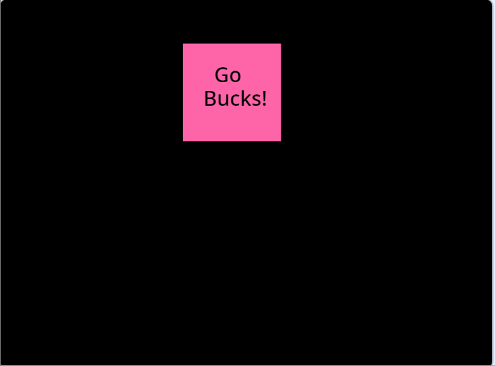

# Screen Saver

Ths goal of this assignment is to use Scratch to create a screen saver similar to the one seen in this episode of The Office:

<iframe width="560" height="315" src="https://www.youtube.com/embed/QOtuX0jL85Y" title="YouTube video player" frameborder="0" allow="accelerometer; autoplay; clipboard-write; encrypted-media; gyroscope; picture-in-picture" allowfullscreen></iframe>

## Reverse Engineering

Your job is to observe the animation below and reverse engineer what you see.  The requirements for your screen saver are the following:

1) You must use Scratch to implement this.
2) The moving object must be a square that bounces around the screen.
3) The square must change colors when it touches the edge, you should have a minimum of four rotating colors.
4) The square should have a text message on it, keep it to one or two words.  Something like "Let's Go"
5) When the square goes *exactly* into the corner the square should stop moving and the text message should change to say something else, such as changing from "Let's Go" to "Wizards".
6) You can add any other type of celebratory flourish for when the corner is reached.

## Submitting

Once finished with your project, save it to your computer as an .sb3 file.  Name the file your first initial + last name + "_screensaver.sb3", so if your name is Harry Potter then "hpotter_screensaver.sb3".

